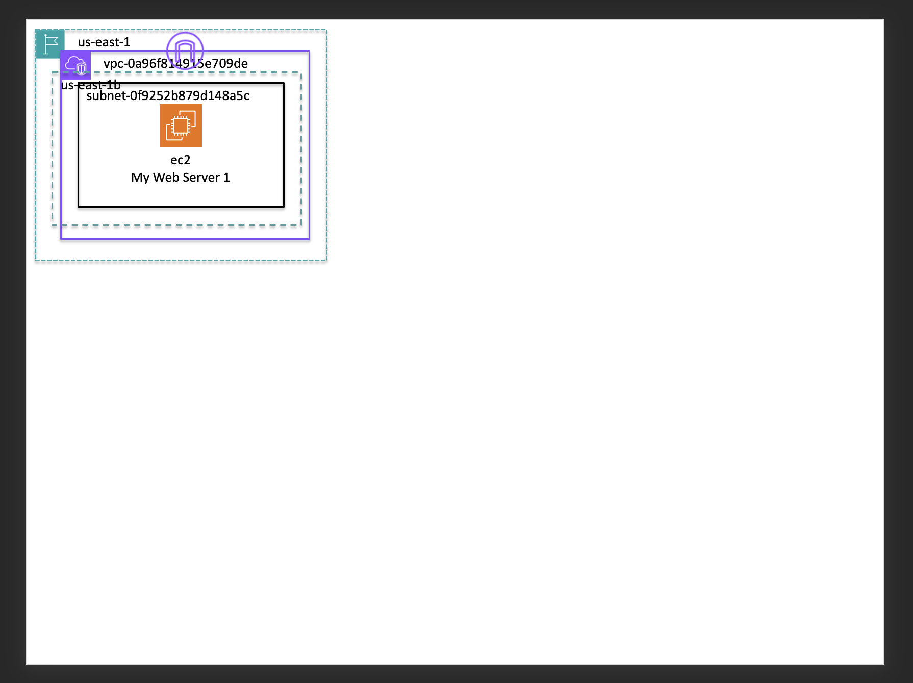

# AWS Resources PowerPoint Projector

A Python utility that automatically generates PowerPoint diagrams of AWS infrastructure from JSON resource data. This tool helps visualize AWS resources and their relationships in a structured, professional presentation format.

## Features

- Converts AWS resource JSON data into organized PowerPoint slides
- Supports multiple AWS resources:
  - EC2 instances
  - RDS databases
  - Elastic Load Balancers (ELB)
  - Other AWS services (expandable)
- Automatically arranges resources by:
  - Region
  - Availability Zone
  - VPC
  - Subnets
- Professional styling with:
  - AWS service icons
  - Color-coded borders
  - Consistent layout and spacing
  - Customizable dimensions and formatting

## Prerequisites

- Python 3.15
- Required Python package:
  - python-pptx

## Installation

1. Clone the repository
2. Install the required package:

```bash
pip install -r requirements.txt
```

## Project Structure

```
aws-resources-pptx-projector/
├── projector.py          # Main script
├── requirements.txt      # Python dependencies
├── data/                # Input data directory
│   └── sample_aws_resources.json
├── images/              # AWS icon assets
│   ├── aws_group_icons/
│   └── aws_icons/
└── powerpoint/          # Output directory
```

## Configuration

The script provides several customizable parameters in `projector.py`:

### User Configuration

```python
# File Locations
FILE_INPUT = Path("data/sample_aws_resources.json")    # Input JSON file
FILE_OUTPUT = Path("powerpoint/sample_output.pptx")    # Output PowerPoint file

# Slide Layout
START_LEFT = Inches(0.1)    # Left margin
START_TOP = Inches(0.1)     # Top margin
SLIDE_W = Inches(13.33)     # Slide width
SLIDE_H = Inches(5.48)      # Slide height

# PowerPoint Styling
PPTX_SLIDE_LAYOUT = 0       # Slide layout type
PPTX_FONT_SIZE = Pt(12)     # Text font size
```

## Input JSON Format

The script expects AWS resource data in a specific JSON format. See `data/sample_aws_resources.json` for an example structure.

## Usage

1. Prepare your AWS resources JSON data in the required format
2. Place it in the `data/` directory
3. Update the `FILE_INPUT` and `FILE_OUTPUT` paths in `projector.py` if needed
4. Run the script:

```bash
python projector.py
```

## Output

Sample output:


The script generates a PowerPoint presentation with:

- Organized layout of AWS resources
- AWS service icons
- Resource grouping by region, AZ, and VPC
- Color-coded borders for different resource groups
- Resource names and identifiers

## Customization

The script includes several customizable parameters for:

- Slide dimensions and layout
- Icon sizes and spacing
- Group styling and borders
- Font sizes and text formatting

See the configuration section in `projector.py` for all available options.
